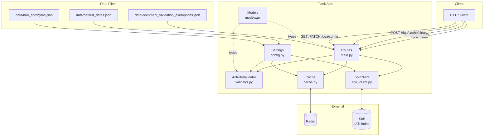
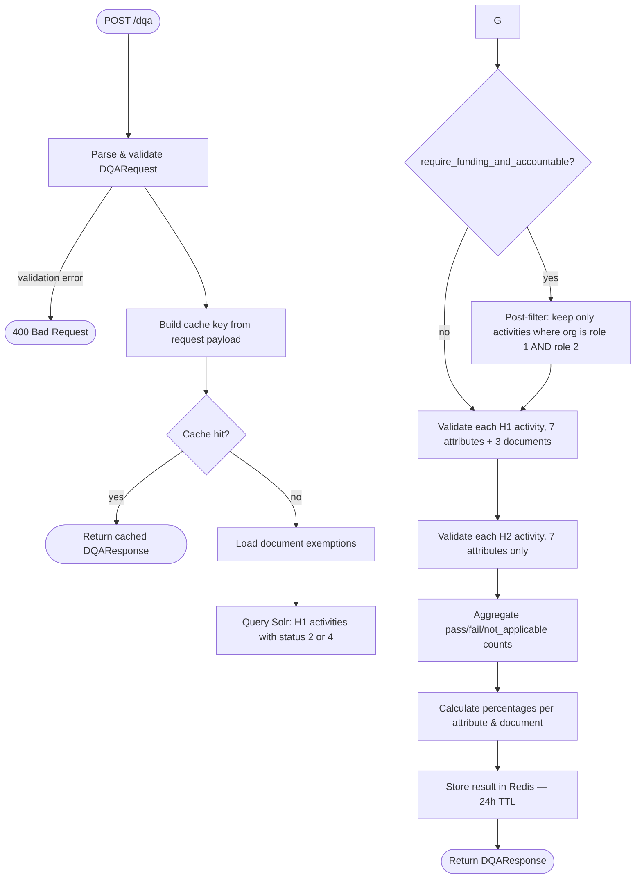
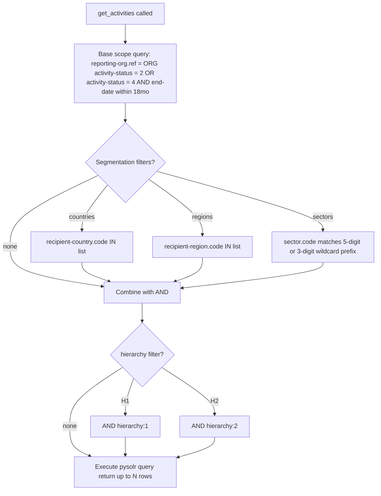
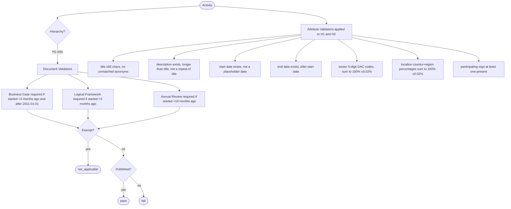
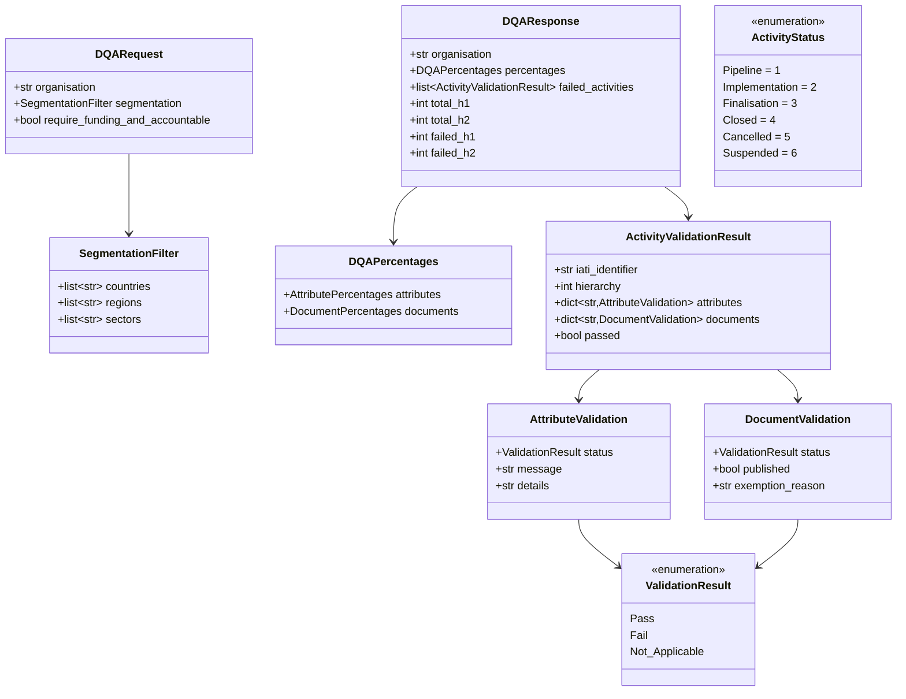
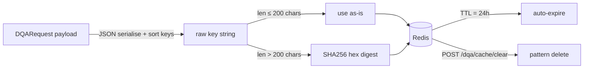

# IATI DQA — Architecture Diagrams

## 1. System Architecture

---

## 2. Request Pipeline — POST /dqa

---

## 3. Solr Query Construction

---

## 4. Validation Rules

---

## 5. Data Models

---

## 6. Cache Key & TTL Strategy

